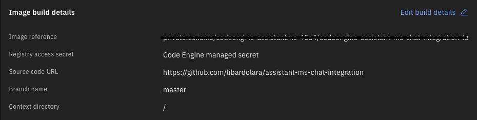
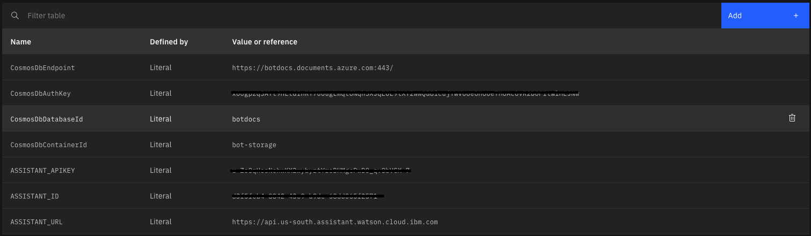
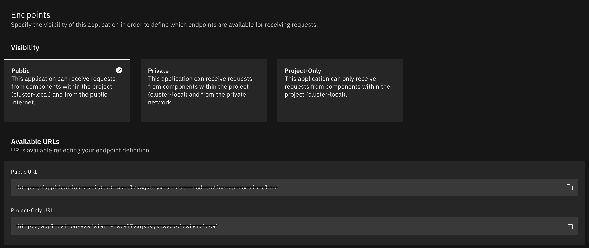
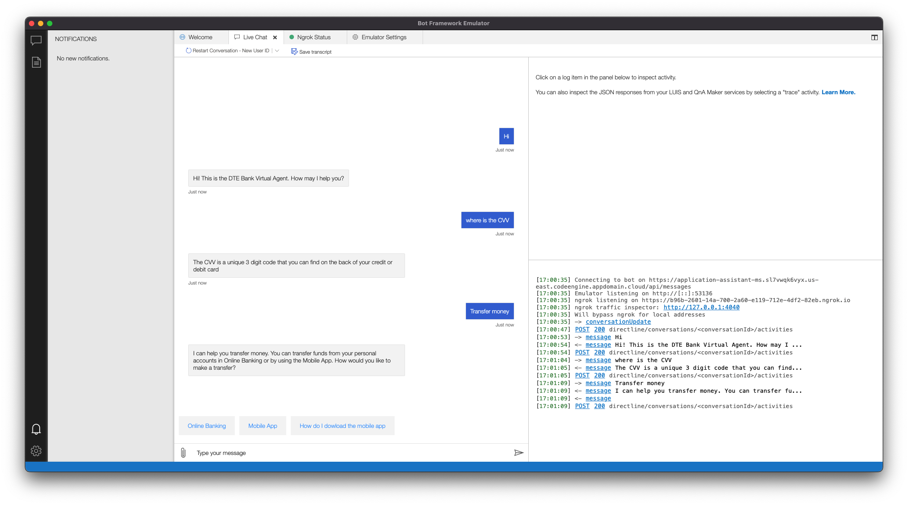

## Deploy to IBM Code Engine on IBM Cloud

[IBM Cloud® Code Engine](https://cloud.ibm.com/codeengine/overview) is a fully managed, serverless platform that runs your containerized workloads, including web apps, micro-services, event-driven functions, or batch jobs. Code Engine even builds container images for you from your source code. All these workloads can seamlessly work together because they are all hosted within the same Kubernetes infrastructure.

## Prerequisites

- [Bot Framework Emulator](https://docs.microsoft.com/en-us/azure/bot-service/bot-service-debug-emulator?view=azure-bot-service-4.0&tabs=csharp) to test your deployment.
- [ngrok v2](https://dl.equinox.io/ngrok/ngrok/stable/archive) to connect **Bot Framework Emulator** to your deployment.

## Deploy to Code Engine

1) Open the [Code Engine](https://cloud.ibm.com/codeengine/overview)

1) Select **Start creating** from *Start from source code*.

1) Select **Application**.

1) Select a project from the list of available projects. You can also [create a new one](https://cloud.ibm.com/docs/codeengine?topic=codeengine-manage-project#create-a-project)
    - Note that you must have a selected project to deploy an app.

1) Enter a name for the application. Use a name for your application that is unique within the project.

1) Select **Source code**.

1) Click **Specify build details**.

1) Select https://github.com/libardolara/assistant-ms-chat-integration for Source repository and **master** for Branch name. Click Next.

1) Select **Dockerfile** for Strategy, `Dockerfile` for Dockerfile, `10m` for Timeout and Medium for Build resources. Click Next.

1) Select a Registry server location, such as `private.us.icr.io` (Dallas).

1) Select an existing namespace or enter a name for a new one — for example, newnamespace.

1) Enter a name for your image and optionally a tag.

1) Click Done.

    

1) Select Listening port as `3978`.

1) Open the **Environment Variables** section. You will need to add several of these (click Add for each):
    - Name: ASSISTANT_APIKEY   Value: <your_watson_assistant_apikey> (From the Watson Assistant service)
    - Name: ASSISTANT_ID   Value: <your_watson_assistant_ID> (From the Watson Assistant service)
    - Name: ASSISTANT_URL   Value: <your_watson_assistant_url> (From the Watson Assistant service)
    - Name: CosmosDbEndpoint   Value: <your_CosmosDb_endpoint> (From Azure CosmoDB service)
    - Name: CosmosDbAuthKey   Value: <your_CosmosDb_AuthKey> (From Azure CosmoDB service)
    - Name: CosmosDbDatabaseId  Value: `botdocs`
    - Name: CosmosDbContainerId  Value: `bot-storage`
    > Optional: Add the variables MicrosoftAppType, MicrosoftAppId, MicrosoftAppPassword, and MicrosoftAppTenantId to connect to Microsoft Teams, Skype or any other Bot Framework applications.

    

1) Click Create and wait until you see a message telling you that your assets are being created

1) Click the Endpoints tabs.

    

1) Copy the Public URL endpoint.

## Test with Bot Framework Emmulator

1) Run [Bot Framework Emulator](https://docs.microsoft.com/en-us/azure/bot-service/bot-service-debug-emulator?view=azure-bot-service-4.0&tabs=csharp)

1) Configure the path to ngrok in the emulator's App Settings dialog. Read [instructions](https://github.com/Microsoft/BotFramework-Emulator/wiki/Tunneling-(ngrok)) for mor information.

1) Open a new bot on the emulator, point it to Public Endpoint copied from Code Engine adding `/api/messages` at the end.
    

## Further reading

- [Getting Started with Code Engine](https://cloud.ibm.com/docs/codeengine?topic=codeengine-getting-started)
- [Deploy app from source code](https://cloud.ibm.com/docs/codeengine?topic=codeengine-app-source-code)

