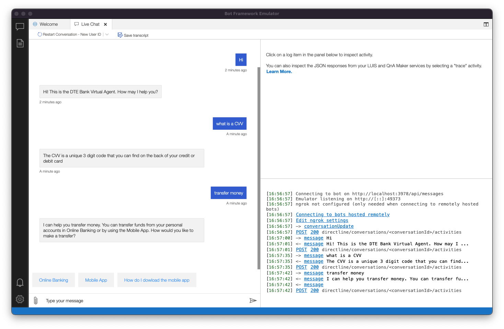

# Watson Assistant - Microsoft Chat Integration

> Based on Bot Framework [message reactions](https://docs.microsoft.com/en-us/microsoftteams/platform/bots/how-to/conversations/subscribe-to-conversation-events?tabs=dotnet#message-reaction-events) bot sample.

This bot has been created using [Bot Framework](https://dev.botframework.com) v4, it shows how to create a simple assistant that responds to messages using [Watson Assistant's](https://cloud.ibm.com/catalog/services/watson-assistant) conversational AI. The chat can be integrated into Microsoft Teams, Skype, Cortana and other services managed by Bot Framework.

## Prerequisites

- [IBM Cloud](https://cloud.ibm.com) account
- [Watson Assistant](https://cloud.ibm.com/catalog/services/watson-assistant) service
- Azure account with CosmoDB database named _botdocs_ and a container id _bot-storage_
- Microsoft Teams is installed and you have an account (Only for live deployment)
- [NodeJS](https://nodejs.org/en/)

## Instructions

1) Clone the repository

    ```bash
    git clone https://github.com/libardolara/assistant-ms-chat-integration.git
    ```

1) Install modules

    ```bash
    npm install
    ```
1) Copy or rename the `.env_example` file to `.env` (nothing before the dot) and add your Watson Assistant details, CosmosDb variables and Microsoft Bot app keys.

```
# Environment variables
MicrosoftAppType=
MicrosoftAppId=
MicrosoftAppPassword=
MicrosoftAppTenantId=
CosmosDbEndpoint=
CosmosDbAuthKey=
CosmosDbDatabaseId="botdocs"
CosmosDbContainerId="bot-storage"

# Watson Assistant Variables
ASSISTANT_APIKEY=
ASSISTANT_ID=
ASSISTANT_URL=
```

### To try this sample locally using Bot Framework Emmulator

1) Install and run [Bot Framework Emulator](https://docs.microsoft.com/en-us/azure/bot-service/bot-service-debug-emulator?view=azure-bot-service-4.0&tabs=csharp)

1) Run your bot at the command line:

    ```bash
    npm start
    ```

1) Open a new bot on [Bot Framework Emulator](https://docs.microsoft.com/en-us/azure/bot-service/bot-service-debug-emulator?view=azure-bot-service-4.0&tabs=csharp), point it to endpoint `http://localhost:3978/api/messages` 





### To try this sample locally using MS Teams

> Note these instructions are for running the sample on your local machine, the tunnelling solution is required because the Teams service needs to call into the bot.


1) Install [ngrok](https://ngrok.com/) and run - point to port 3978
    - You will need to sign in to [setup](https://dashboard.ngrok.com/get-started/setup).
    
    ```bash
    ngrok http --host-header=rewrite 3978
    ```

1) Create [Bot Framework registration resource](https://docs.microsoft.com/en-us/azure/bot-service/bot-service-quickstart-registration) in Azure
    - Use the current `https` URL you were given by running ngrok. Append with the path `/api/messages` used by this sample
    - Ensure that you've [enabled the Teams Channel](https://docs.microsoft.com/en-us/azure/bot-service/channel-connect-teams?view=azure-bot-service-4.0)
    - __*If you don't have an Azure account*__ you can use this [Bot Framework registration](https://docs.microsoft.com/en-us/microsoftteams/platform/bots/how-to/create-a-bot-for-teams#register-your-web-service-with-the-bot-framework)

1) Update the `.env` configuration for the bot to use the Microsoft App Id and App Password from the Bot Framework registration. (Note the App Password is referred to as the "client secret" in the azure portal and you can always create a new client secret anytime.)

1) __*This step is specific to Teams.*__
    - **Edit** the `manifest.json` contained in the  `teamsAppManifest` folder to replace your Microsoft App Id (that was created when you registered your bot earlier) *everywhere* you see the place holder string `<<YOUR-MICROSOFT-APP-ID>>` (depending on the scenario the Microsoft App Id may occur multiple times in the `manifest.json`)
    - **Zip** up the contents of the `teamsAppManifest` folder to create a `manifest.zip`
    - **Upload** the `manifest.zip` to Teams (in the Apps view click "Upload a custom app")

1) Run your bot at the command line:

    ```bash
    npm start
    ```

## Interacting with the bot in Teams

Message the bot and Watson Assistant will respond.

## Deploy the bot to IBM Cloud

Learn how to deploy this application on [IBM Cloud Code Engine](CODE.md)

## Further reading

- [How Microsoft Teams bots work](https://docs.microsoft.com/en-us/azure/bot-service/bot-builder-basics-teams?view=azure-bot-service-4.0&tabs=javascript)
- [Test and debug your bot locally](https://docs.microsoft.com/en-us/microsoftteams/platform/bots/how-to/debug/locally-with-an-ide)
- [Test and debug with the Emulator](https://docs.microsoft.com/en-us/azure/bot-service/bot-service-debug-emulator?view=azure-bot-service-4.0&preserve-view=true&tabs=javascript)


